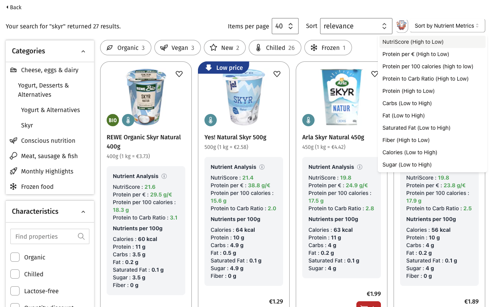
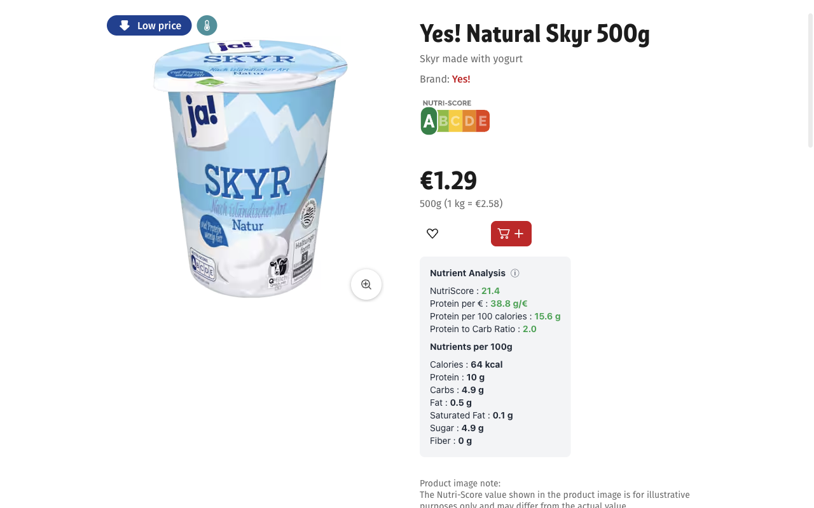
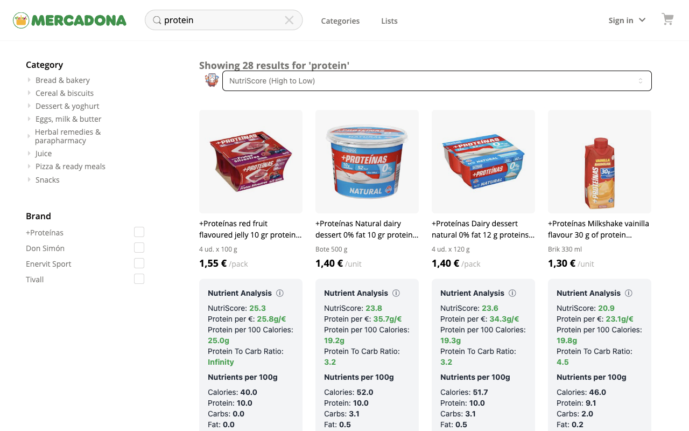
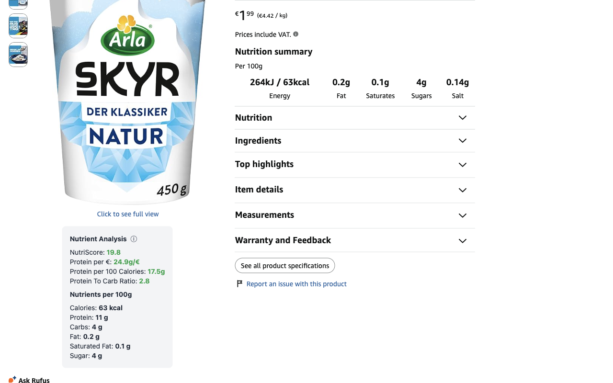

  

# 🥗 NutriData Extension

**Enhance your online grocery shopping with instant nutritional insights!**

## 🎯 Motivation

Ever struggled to make healthy choices while shopping online? NutriData is here to help! We empower consumers by presenting clear, easily comparable nutritional information right on product pages and search results.

## ✨ Features

### Supported shops

| Shop                            | Product pages | Search & category pages | Sorting |
| ------------------------------- | :-----------: | :---------------------: | :-----: |
| REWE (rewe.de)                  |      ✅       |           ✅            |   ✅    |
| Mercadona (tienda.mercadona.es) |      ✅       |           ✅            |   ✅    |
| Amazon.de and Amazon.co.uk      |      ✅       |           ✅            |    —    |

- **Mercadona:** nutrition comes from a dataset bundled with the extension (about 2,400 products, from Open Food Facts plus OCR of product labels), so products outside it show no metrics.
- **Amazon:** works where the product page lists nutrition facts, which many grocery listings do.

### Product pages

- **Key metrics:**
  - 📊 NutriScore - a protein-focused score (see below)
  - 💪 Protein per euro/pound (g/€ or g/£)
  - 🔥 Protein per 100 calories (g)
  - 🍞 Protein to carb ratio
- Nutrients per 100 g: calories, protein, carbs, fat, saturated fat, sugar, fiber
- Color-coded metrics for quick assessment (🔴 to 🟢)

### Search results and category pages

- Metrics on every product card, including cards that load later
- **Sort the list** (REWE and Mercadona):
  - NutriScore, protein per €, protein per 100 calories, protein to carb ratio, protein, fiber (high to low)
  - Carbs, fat, saturated fat, calories, sugar (low to high)

### Settings

- Turn each shop on or off
- Sort search results by NutriScore automatically
- Hide the metric cards on search pages

### What is NutriScore in this extension?

The NutriScore shown by NutriData is a custom metric, **not** the official Nutri-Score (A-E) rating used in some European countries. It ranks foods by protein density and value:

- A weighted geometric mean of protein per 100 calories (weight 0.65) and protein per € (weight 0.35)
- Raised by fiber: up to +15%. When a label leaves fiber out, it's estimated from the energy the other nutrients don't account for
- Lowered by saturated fat: 1% per gram per 100 g, at most −50%
- Lowered by sugar beyond the first 5 g per 100 g: at most −40%

Higher scores are better. The same formula ranks products on the [protein index](https://protein-index.mohamed3on.com).

### 📈 Protein index contributions

On REWE product pages, NutriData sends the product's public details (name, brand, price, nutrition values, category) to protein-index.mohamed3on.com to keep the public protein index up to date. Each product is sent at most about once a week, and no personal data or identifiers are sent.

## 🚀 Installation

### Option 1: Chrome Web Store

1. Visit the [NutriData Chrome Web Store page](https://chromewebstore.google.com/detail/nutridata-product-nutriti/pkgppeffgmpdjldplgbplbfcmckjemao?authuser=0&hl=en)
2. Click "Add to Chrome"

Every release is submitted to the store automatically, so it lags GitHub only by the store's review time (usually a few days).

### Option 2: Manual Installation for Chrome (Latest Release)

1. Go to the [Releases page](https://github.com/mohamed3on/nutridata/releases) on GitHub
2. Download the latest `build-chrome.zip` file
3. Unzip the file
4. Open Chrome and go to `chrome://extensions/`
5. Enable "Developer mode" (top right)
6. Click "Load unpacked" and select the unzipped extension directory

### Option 3: Manual Installation for Firefox (Latest Release)

1. Go to the [Releases page](https://github.com/mohamed3on/nutridata/releases) on GitHub
2. Download the latest `build-firefox.zip` file
3. Open Firefox and go to `about:debugging#/runtime/this-firefox`
4. Click "Load Temporary Add-on"
5. Navigate to the download directory and select the zip file

## 🛠 Usage

1. Visit rewe.de, tienda.mercadona.es, amazon.de or amazon.co.uk
2. Open a product, a search or a category: the metrics appear on the page
3. On REWE and Mercadona lists, pick a metric from "Sort by Nutrient Metrics"

## 🚀 Automatic Releases

When changes are pushed to the `main` branch:

1. The version number is bumped based on commit messages.
2. A GitHub release is created, with release notes generated from the commits and Chrome and Firefox builds attached.
3. The new version is submitted to the Chrome Web Store for review ([`chrome-web-store.yml`](.github/workflows/chrome-web-store.yml) runs [`scripts/publish-chrome-web-store.ts`](scripts/publish-chrome-web-store.ts)). If an earlier version is still in review, a daily run submits the new one once that review clears.

To ensure proper versioning, please use conventional commit messages:

- `feat: ...` for new features (bumps minor version)
- `fix: ...` for bug fixes (bumps patch version)
- `BREAKING CHANGE: ...` for breaking changes (bumps major version)

For more information on conventional commits, see [conventionalcommits.org](https://www.conventionalcommits.org/).

## 🔧 Customization

Tweak the extension by modifying:

- `src/utils.ts`: Adjust `COLOR_THRESHOLDS` for metric color-coding
- `src/nutriScore.ts`: The NutriScore formula
- `src/components/MetricsCard.tsx`: The metrics card UI
- `src/shops/`: How each shop's pages are read

The bundled Mercadona dataset (`public/mercadona-nutrients.json`) is built by `scripts/ocr-batch-mercadona.py`.

## 🤝 Contributing

Contributions are welcome! Feel free to submit a Pull Request.

## 📄 License

This project is licensed under the Mozilla Public License 2.0 (MPL-2.0).
